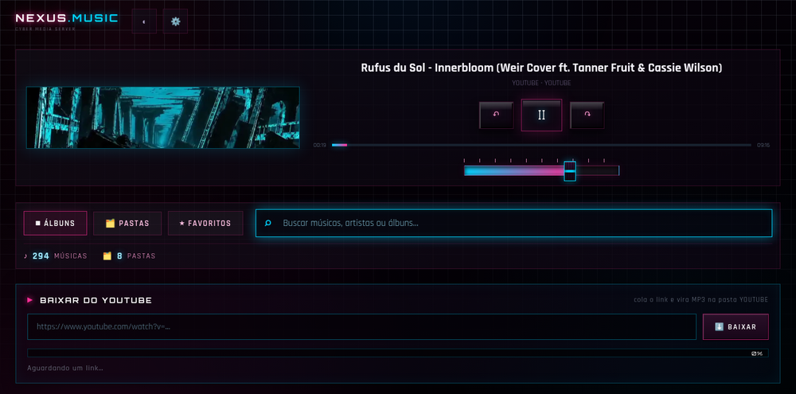
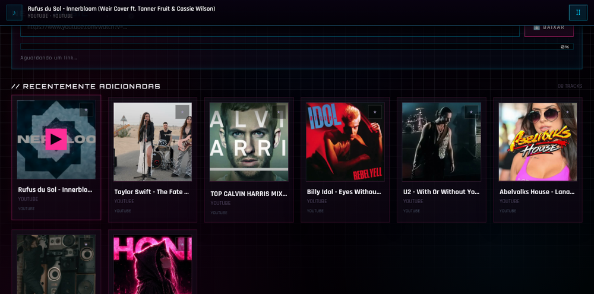

<div align="center">

# NEXUS MUSIC

**An offline-first Android music player with a retro-cyberpunk interface.**

Plays your local library. Downloads from YouTube on the device itself.
Works on mobile data, on any network — **no computer, no server required.**

[](LICENSE)
[](#-build)
[](#-architecture)

</div>

---

## 📸 Screenshots

| Player (retro controls + effect screen) | Recently added (favorites ★) |
|---|---|
|  |  |

---

## ✨ Features

| | |
|---|---|
| 📚 **Your library** | Reads MP3/M4A/FLAC from the device via `MediaStore` — no import step, no cloud |
| ⬇️ **YouTube → audio** | Paste a link and the app downloads and converts it **on the phone** |
| ⚡ **Parallel download** | 5 concurrent `Range` connections — **5.7× faster** than a single stream (measured) |
| ★ **Favorites** | Saved to a file in the app, so they survive restarts and browser/cache wipes |
| 🎛️ **Retro player** | Analog-style controls, mixer fader, chunky 3D keys that press down |
| 🎬 **Video effect screen** | Animated backdrop in the player, bundled in the APK |
| 🖐️ **Gesture navigation** | Swipe right to go up a folder level; Android back never breaks |
| 🎧 **Now playing bar** | Appears when the player scrolls out of view, tap to jump back |
| 🔍 **Search** | By title, artist or album |

---

## 🏗️ Architecture

The interesting part: a **WebView app that is also its own web server**.

```
┌───────────────────────────── Android app ─────────────────────────────┐
│                                                                       │
│   MainActivity (WebView)  ──HTTP──▶  NexusServer  127.0.0.1:FIXED_PORT │
│                                        │                              │
│                                        ├─ /api/music   → MediaStore   │
│                                        ├─ /api/favs    → favs.json    │
│                                        ├─ /api/effects → assets/      │
│                                        └─ /music/<id>  → Range stream │
│                                                                       │
│   YtDownload (NewPipe Extractor)  →  download + convert  →  MediaStore │
└───────────────────────────────────────────────────────────────────────┘
```

**Why a local HTTP server instead of `file://`?** A `file://` WebView cannot stream audio with
`Range` requests, which breaks seeking. Serving the UI from `http://127.0.0.1:<port>` gives a normal
web origin with full media support — and lets the entire interface stay plain HTML/CSS/JS.

> ⚠️ **The port must be FIXED.** `localStorage` is scoped per **origin** (scheme + host + **port**),
> so a randomly assigned port means a different storage area on every launch — favorites would look
> like they vanished. This project uses a fixed port (`8477`), plus file-backed storage for anything
> that must survive.

| Layer | Tech |
|---|---|
| UI | Single-file HTML/CSS/JS (no framework, no build step) |
| Native bridge | `NexusServer` — `ServerSocket` + hand-rolled HTTP with `Range` support |
| Library | `MediaStore` (Android 13+ permissions handled) |
| Downloader | [NewPipe Extractor](https://github.com/TeamNewPipe/NewPipeExtractor) |
| Build | Gradle wrapper + JDK 17 + cmdline-tools (no Android Studio needed) |

---

## 🔧 Build

Requirements: **JDK 17** and the **Android SDK** (`compileSdk 34`, `build-tools 34.0.0`).

```bash
# point Gradle at your SDK (this file is git-ignored)
echo "sdk.dir=$HOME/Android/Sdk" > local.properties

# debug build
./gradlew assembleDebug
# → app/build/outputs/apk/debug/app-debug.apk
```

No Android Studio required — `cmdline-tools` + the Gradle wrapper are enough.

Install with `adb install -r app-debug.apk`, or copy the APK to the phone.

---

## ⚖️ License & Credits

**GPL-3.0** — see [LICENSE](LICENSE).

The license is **GPL-3.0** because this app uses the
[NewPipe Extractor](https://github.com/TeamNewPipe/NewPipeExtractor), which is GPL-3.0 (copyleft).
Any distributed build that includes it must be GPL-3.0 as well. Credit goes to the NewPipe team —
their extractor is what makes on-device downloading possible.

| Project | License | Role |
|---|---|---|
| [NewPipe Extractor](https://github.com/TeamNewPipe/NewPipeExtractor) | GPL-3.0 | streaming extraction |
| [yt-dlp](https://github.com/yt-dlp/yt-dlp) | Unlicense | used by the companion PC server (not in this APK) |

---

## ⚠️ Legal notice

This app is **not affiliated with, endorsed by, or sponsored by YouTube or Google**.

Downloading videos may violate YouTube's Terms of Service, and content is protected by copyright.
**Use it only for content you own or are legally allowed to download** — personal backups, your own
uploads, public-domain or Creative Commons material.

The author does not condone piracy. It is published as **open source for educational and personal
use**, without any warranty.

---

## 🇧🇷 Em português

**Um player de música Android que funciona sem computador e sem servidor.**

Lê a biblioteca do próprio celular, baixa do YouTube **no aparelho** e funciona com dados móveis, em
qualquer rede.

- 🎨 Interface **cyber/retrô**: cantos retos, controles analógicos, fader estilo mesa de som;
- ⚡ Download **5,7× mais rápido** (5 conexões em paralelo, medido com hash idêntico);
- ★ Favoritos que **persistem de verdade** (arquivo no app, não só no navegador);
- 🖐️ Navegação por **gesto** e mini-player "agora tocando".

**Licença GPL-3.0** (obrigatória por usar o NewPipe Extractor). O código está aberto para estudo e uso
pessoal — respeite os direitos autorais do conteúdo que baixar.

---

<div align="center">

*Built by Leandro · 2026*

</div>
